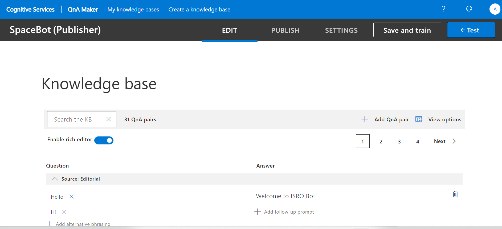
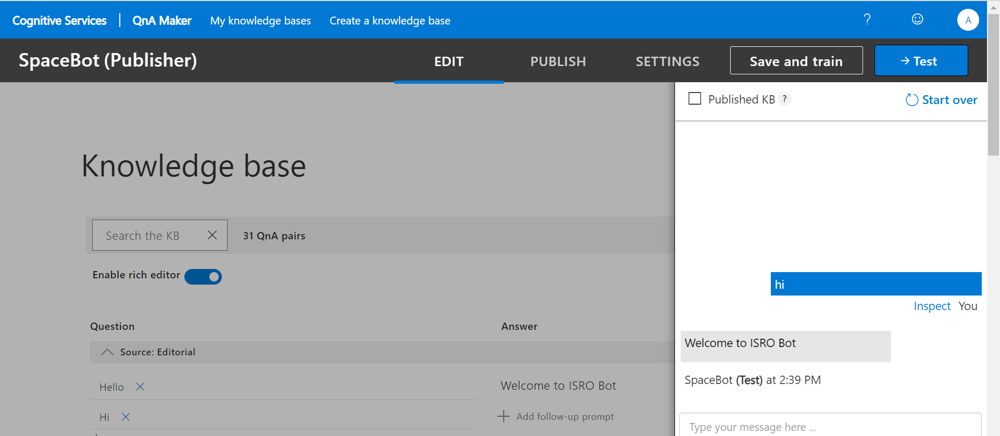
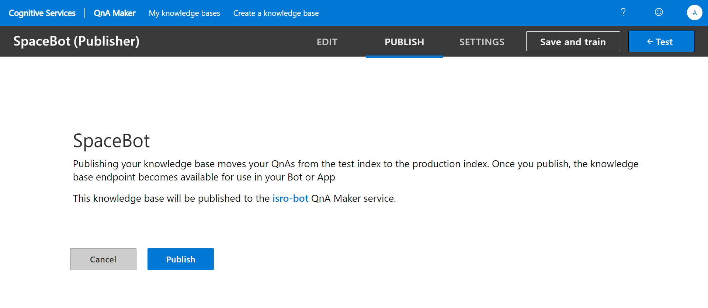
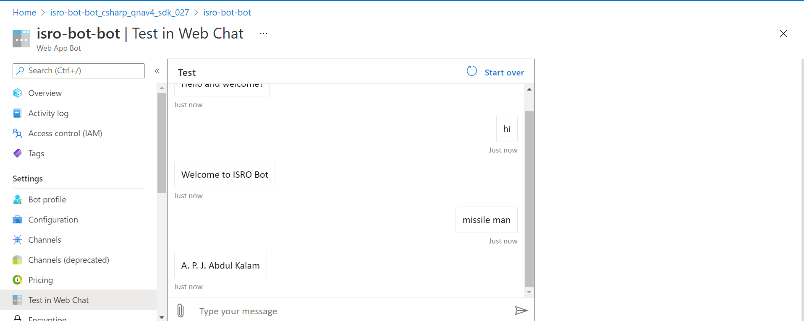

# FRT_Project
Intially I have created a knowledge base using QnA maker Service

I have saved and trained the Knowledge base after giving the QnA pairs.

I further tested my chat bot

I have published my chat bot to web

afer successfully deploying the chat bot to web.I have tested my bot in test in web chat

The working link of bot is https://webchat.botframework.com/embed/isro-bot-bot?s=KqixHbtygFw.80E5uX7Qkqm0PzT1KmxjrcqlTTyinM798SKMtkCoycE

The Demo link of the project https://www.youtube.com/watch?v=0r8MLdtAfrk 
